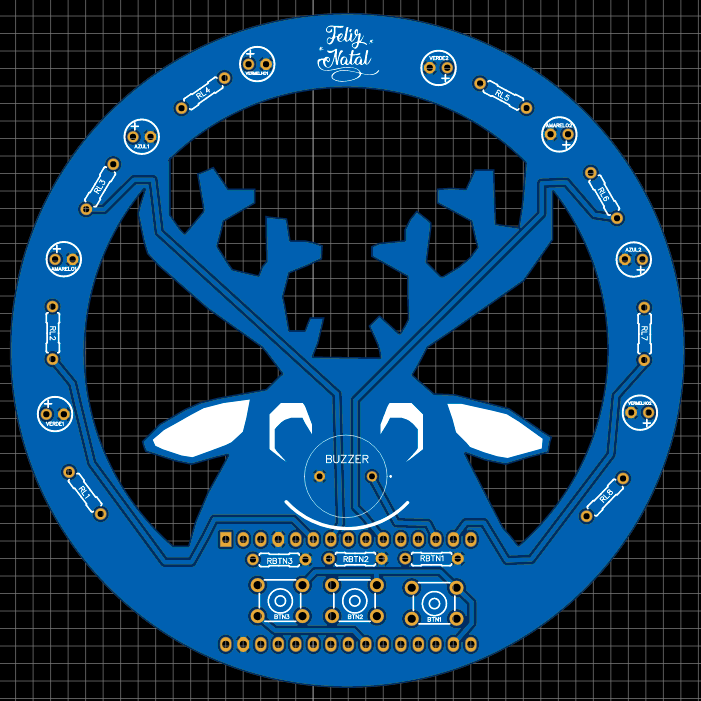
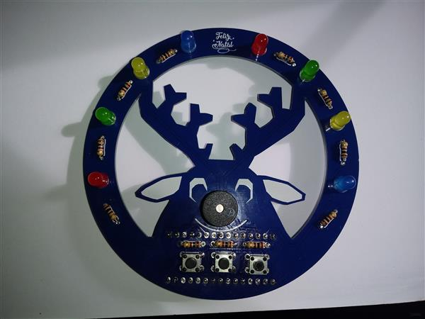

# PCB-natalina-2021

## 🤔 O que é este projeto?
Este projeto se trata de uma placa de circuito impresso (PCB) artística com o tema natalino desenvolvida para o **Julialabs PCB Challange 2021** utilizando o software **Easy EDA**.

A PCB em questão foi desenvolvida tendo em mente o projeto de uma caixinha de músicas natalinas utilizando arduino. O projeto contém um buzzer e LEDs que serão responsáveis pela reprodução de uma das três músicas disponíveis no programa que estará no microcontrolador (deck the halls, silent night e jingle bells). 

O projeto também está disponível no compartilhamento da PCB way, e você pode acessá-lo por lá [clicando aqui](https://www.pcbway.com/project/shareproject/Musical_Christmas_Reindeer_0cf8bc23.html).

## 🤔 Como este projeto está estruturado?
* Project.zip: arquivos de desenvolvimento do projeto;
* Pasta imagens: contém imagens do projeto, incluindo as referências de design da placa;
* Pasta codigo: contém os arquivos referentes ao desenvolvimento do código fonte para o arduino;
* Pasta musicas: Protótipo das músicas no sonic pi e projeto para o arduino propriamente dito;

## ⚙️ Componentes necessários para o projeto
A lista de componentes detalhada deste projeto pode ser encontrada na Mouser na forma de um carrinho de compras [clicando aqui.](https://www.mouser.com/ProjectManager/ProjectDetail.aspx?AccessID=d268b8d18b)

Optei pela utilização de componentes PTH neste projeto porque o processo de solda é mais simples.

|Componente|Quantidade|Observação|
|:----------:|:----------:|:----------:|
| [Arduino Nano](https://www.mouser.com/ProductDetail/782-ABX00028)  | 1  | Também será a fonte de energia da placa  |
| [LED azul](https://www.mouser.com/ProductDetail/941-C503BBASCX0B0461)  |  2 |   |
| [LED vermelho](https://www.mouser.com/ProductDetail/941-C503BRCNCW0X0AA1)| 2 |   |   |
| [LED verde](https://www.mouser.com/ProductDetail/941-C503BGANCB0F0791)  |  2 |   |
| [LED amarelo](https://www.mouser.com/ProductDetail/941-C503BAANCY0B0251)  | 2  |   |
| [Resistor de 100 ohms](https://www.mouser.com/ProductDetail/594-5043ED100R0F)  | 4  | Usados nos LEDs azuis e verdes  |
| [Resistor de 150 ohms](https://www.mouser.com/ProductDetail/594-MBB02070C1500FRP)  | 4  | Usados nos LEDs amarelos e vermelhos  |
| [Resistor de 1k ohms](https://www.mouser.com/ProductDetail/594-SFR2500001001JR5)  | 3  | Usados como pull-down nos botões  |
| [Piezo Buzzer](https://www.mouser.com/ProductDetail/497-IE122303-1)  | 1  |   |
| [Chave tátil](https://www.mouser.com/ProductDetail/506-1-1825910-4) | 3  |   |

 
